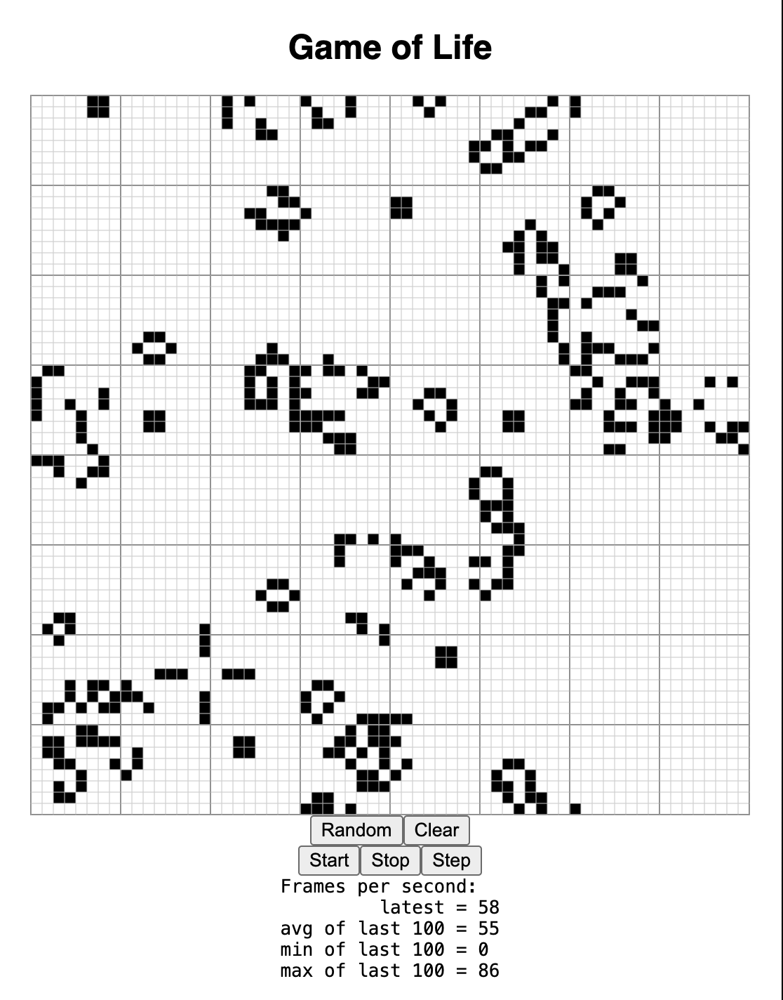

# Conway's Game Of Life implemented with the Dioxus framework
An implementation of [Conway's game of life](https://en.wikipedia.org/wiki/Conway%27s_Game_of_Life) using the Dioxus framework,
adapted from the [rust wasm tutorial](https://rustwasm.github.io/docs/book/game-of-life/introduction.html).

The code from the original tutorial is about 50% Rust, 50% JavaScript.
With the Dioxus framework the code is 100% Rust.

## Demonstrates
* A Dioxus web app written completely in Rust.
* Frame animation using get_next_frame() and abstracting to a Dioxus "use" hook.
  * Limited by the frame rate of the monitor.
  * A FramesPerSecond component that displays the current frames per second.
* Building a component from a 2d HTML canvas.
* Using using Dioxus' onmount event to get an element (similar to react's use_ref)

## Install and run
* Install the rust development environment: https://www.rust-lang.org/tools/install
* Install the [dioxus CLI](https://dioxuslabs.com/learn/0.4/CLI/installation): `cargo install dioxus-cli`
* Install the wasm target for rust: `rustup target add wasm32-unknown-unknown`
* clone this repository: `git clone https://github.com/kimonp/dioxus-game-of-life.git`
* `cd dioxus-game-of-life`
* Run in debug mode with the dioxus cli: `dx serve --platform=web`
* Point your browser at: http://localhost:8080

## Methodology
Defines a `GameOfLifeGrid` component that renders the game of life (with several control buttons),
and a `FramesPerSecond` component which shows how many frames per seconds are being rendered (which
depends on the monitor frame rate).

This is stitched together using a `use_animation_frame()` hook returns a `frame_id` that can be used
to trigger `use_effect` calls to render each frame (for the grid, and frames per second).  Also returns
`frames_running`, which can be set false or true to stop or start the frames.